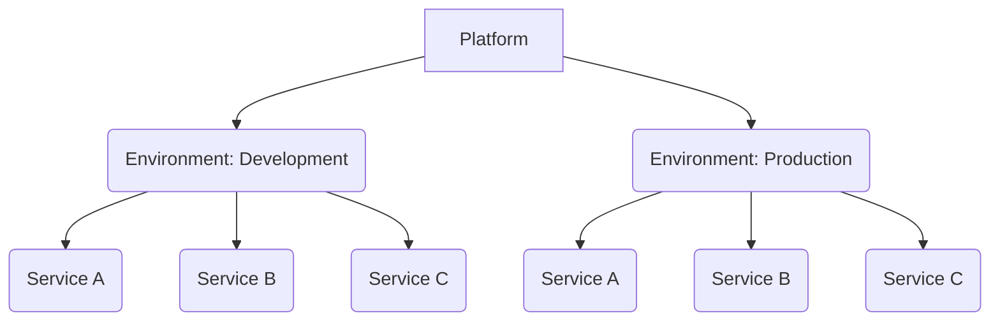

# Microservices Architecture Template

This microservices template is targeted at SMEs and smaller teams and focuses on the following key aspects:

* *Use "infrastructure as code" and automation to improve time-to-market and to leverage industry best-practices.*
* *Use serverless hosting to minimize the operations efforts for the team.*
* *Minimize the amount of programming languages to reduce development complexity.*

The template focuses on the **solution architecture** and **infrastructure automation** by leveraging industry best-practices and by finding the "right" compromises when following microservices guidelines, which are often targeted at big corporations.

The template is meant to be a "production-ready starting point" that is easy to extend with your own services. For the most part, it does *not* force any specific software architecture or folder structure within the services.

The template uses the following technologies:
* Microsoft .NET for the microservices
* Azure Container Apps & Dapr for hosting
* Azure PowerShell & Azure Bicep for infrastructure as code
* GitHub for code hosting and GitHub Actions for CI/CD

### Highlights:

* **(Almost) no secrets**
  * Wherever possible, authentication is done via Azure AD and managed identities. This includes GitHub Actions & Azure SQL Database access.
* **Script for connecting GitHub with Azure**
  * With one script, all the necessary resources are created in your GitHub repository and in your Azure account to allow you to deploy from GitHub to Azure.
  * Authentication is done via an Azure AD managed identity and deployments are done via GitHub environments that allow you to set up protection rules (e.g. required reviewers, ...).
* **Fully automated SQL migrations during deployment**
  * The service's identity is automatically added to the SQL database with db_datareader/db_datawriter permissions.
  * EF Core Migrations are automatically applied during deployment by an admin identity with elevated privileges.
* **Sample services for different use cases**
  * gRPC, HTTP APIs, SQL DB, Publish/Subscribe

# Overview

If you look at a microservices solution from an operations view, it can typically be split into 3 parts:

* **Platform**: The *platform* contains global resources that are shared by all environments and services, e.g. the Container registry that contains all Docker images. The platform is set up at the beginning of a project and typically changes very rarely.
* **Environments**: The microservice solution is deployed into one or more *environments*, e.g. "development" and "production". Environments do not share any resources between them. An environment uses the *platform*-resources and contains all its *services*. In many cases, the services of one environment need some resources that are shared by all services of the environment, e.g. a hosting cluster, or some shared networking infrastructure. These shared resources must be set up before any service can be deployed and they might change independently of any service.
* **Services**: A service is the instance of one microservice. It is deployed into one or more environments and contains an app and its dependencies. A service may use shared resources from the *platform* (e.g. the Container Registry) and its *environment* (e.g. hosting cluster). Services might change often and might be created and destroyed at different points during the lifecycle of an environment.



Since these parts have a different lifecycle and might be managed by different people, we built separate GitHub workflows for each them. This is one important difference to many other templates, where often the entire solution must be deployed at once.

## Platform

For this template, the **platform** contains the following resources that are shared by all environments and their services:

### GitHub repository / GitHub Actions
The template follows the **monorepo**-pattern by keeping all services in one GitHub repository. This simplifies the developer experience and maximizes the ability to share code.

CI/CD is done via **GitHub Actions**, which allows you to deploy all parts of the system with separate workflows.

### Azure Managed Identity for GitHub Actions

GitHub Actions uses a user-assigned managed identity to authenticate with Azure. The authentication leverages [federated credentials](https://docs.microsoft.com/en-us/azure/developer/github/connect-from-azure) which means that there are no secrets stored in your GitHub repository!

### Azure Container Registry

Services are built using Docker and container images are stored in a Azure container registry.

As no environment-specific logic should be included in a container image, we do not use an environment-specific registry.

All services are given RBAC-based "AcrPull"-access to the container registry.

### Azure Log Analytics Workspace

Microsoft recommends to start with a single workspace since this reduces the complexity of managing multiple workspaces and in querying data from them
(https://docs.microsoft.com/en-us/azure/azure-monitor/logs/workspace-design).

This template therefore uses one Log Analytics workspace that's shared by all services and environments.

Each environment however uses its own "Application Insights"-instance (which are backed by the shared Log Analytics workspace)

### Azure Storage Account

There is one global Azure Storage account that can be used for data that's needed by all environments and services.

We currently use it to store the SQL migration scripts.

## Environments

An environment in our template consists of the following resources:

### Azure Virtual Network

To ensure communication is happening via a private network, the Azure Container Apps environment is deployed into a VNET.

You can use VNET peering to connect the VNET to your hub if you use a [Hub-spoke network topology](https://docs.microsoft.com/en-us/azure/architecture/reference-architectures/hybrid-networking/hub-spoke?tabs=cli)

### Azure Container Apps environment

TODO

### Azure Application Insights

TODO

### Azure SQL Server

TODO

### Azure Service Bus namespace

TODO

## Services

Each service in our template consists of the following resources:

### Azure managed identity

TODO

### Azure Container Apps app

TODO

### Optional: Azure SQL Database

TODO

# Usage

You can use this template by following these steps:

* Download this repository (or fork it if you don't mind its git history)
* Adjust the deployment configuration `.\infrastructure\config.json`
* Push your changes to a GitHub repository
* Execute the platform initialization script locally `.\infrastructure\init-platform.ps1`
* Deploy the shared platform resources via GitHub Actions
* Deploy the shared environment resources via GitHub Actions
* Deploy the sample services via GitHub Actions
* Add your own services
* Add your own environments

## Adjust the deployment configuration

## Initialize the platform

To automate the deployment of Azure resources, the GitHub repository must be connected to the Azure subscription. As this connection requires elevated permissions and multiple steps, we provide the following script to automates them: `.\infrastructure\init-platform.ps1`.

The script will create an Azure AD managed identity that will be used by GitHub Actions to deploy resources to Azure. The credentials of this application will be stored as "secrets" in the GitHub repository.

The script will also create the configured "environments" from `.\infrastructure\config.json` in the GitHub repository to allow for environment-specific protection rules when deploying resources.

### Required tools
To run the initialization script, you must have the following tools installed:
* PowerShell 7+: https://docs.microsoft.com/en-us/powershell/scripting/install/installing-powershell
* Azure PowerShell module: https://docs.microsoft.com/en-us/powershell/azure/install-az-ps
* Bicep CLI: https://docs.microsoft.com/en-us/azure/azure-resource-manager/bicep/install
* GitHub CLI: https://github.com/cli/cli#installation

### Executing the script
The script must be executed in a PowerShell session by using the following command.

**Important:** This script must be executed by a user who is an Azure _Global Administrator_ and who has admin permissions in the GitHub repository.

```pwsh
cd .\infrastructure\
.\init-platform.ps1
```

## Deploy the shared platform resources

The deployment can be done via the GitHub workflow `.github\workflows\platform.yml` ("1. Platform").

## Deploy the shared environment resources

The deployment can be done via the GitHub workflow `.github\workflows\environments.yml` ("2. Environments").

## Deploy the services

Each service has its own GitHub workflow. The workflows are stored in `.github\workflows\service-*.yml`.

## Add a new service

TODO

## Add a new environment

* Open `.\infrastructure\config.json`
* Duplicate an existing environment section (e.g. `development`).
* Modify the environment name and all its content as desired.
* Add the environment to `.\.github\workflows\environments.yml`.
* Add the environment to all `.\.github\workflows\service-*.yml` files by duplicating and adjusting an existing `deploy-*`-job.
* Re-run the platform initialization script `.\infrastructure\init-platform.ps1`
  * This will create the necessary environment in GitHub and its connection with the Azure subscription.
* Adjust the environment protection rules in GitHub if necessary (required reviewers)
* Deploy the shared resources to the new environment via the GitHub Action
* Deploy services into the new environment via the GitHub Actions

# Deleting all resources

If you want to delete all resources that have been created by this project, you must perform the following *manual* steps:

* Delete the subscription role assignments for the GitHub identity (e.g. `lab-msa-github`)
* Delete all Azure resource groups with the tag `product: (config.platformResourcePrefix)` (e.g. `product: lab-msa`)
  * You should delete all service-groups first, environment-groups second, and platform-groups last.
* Delete Azure AD groups that start with `(config.platformResourcePrefix)-` (e.g. `lab-msa-dev-sql-admins`)
* Delete all secrets from your GitHub repository
* Delete all environments from your GitHub repository
* Delete any GitHub Actions workflow runs
