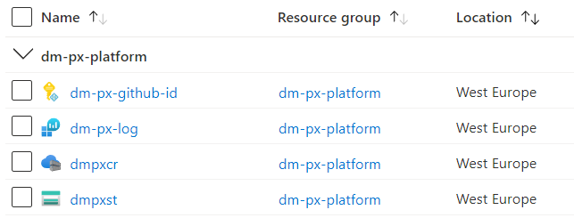

# Microservices Architecture Template

This microservices template is targeted at SMEs and smaller teams and focuses on the following key aspects:

* *Use "infrastructure as code" and automation to improve time-to-market and to leverage industry best-practices.*
* *Use serverless hosting to minimize the operations efforts for the team.*
* *Minimize the amount of programming languages to reduce development complexity.*

The template focuses on the **solution architecture** and **infrastructure automation** by leveraging industry best-practices and by finding the "right" compromises when following microservices guidelines, which are often targeted at big corporations.

The template is meant to be a "production-ready starting point" that is easy to extend with your own services. For the most part, it does *not* force any specific software architecture or folder structure within the services.

The template uses the following technologies:
* Microsoft .NET 7 for the microservices
* Azure Container Apps & Dapr for hosting
* Azure PowerShell & Azure Bicep for infrastructure as code
* GitHub for code hosting and GitHub Actions for CI/CD

### Highlights:

* **Script for connecting GitHub with Azure**
  * With one script, all the necessary resources are created in your GitHub repository and in your Azure account to allow you to deploy from GitHub to Azure.
  * Authentication is done via an Azure AD managed identity and deployments are done via GitHub environments that allow you to set up protection rules (e.g. required reviewers, ...).
* **Sample services for different use cases**
  * An internal gRPC service without any external dependencies
  * An internal gRPC service with Azure SQL Database, Azure Service Bus, and service-to-service communication
  * An internal HTTP service with Azure Service Bus
  * A public Razor Pages website that communicates with the internal services
* **Fully automated SQL migrations during deployment**
  * The service's identity is automatically added to the SQL database with db_datareader/db_datawriter permissions.
  * EF Core Migrations are automatically applied during deployment by an admin identity with elevated privileges.
  * This means you can deploy a SQL-based service and immediately use it without any manual steps.
* **ZERO passwords or secrets**
  * Authentication is done entirely via Azure AD, managed identities, and [federated credentials](https://docs.microsoft.com/en-us/graph/api/resources/federatedidentitycredentials-overview). This includes GitHub Actions and access to Azure SQL Database & Azure Service Bus.

# Overview

If you look at a microservices solution from an operations view, it can typically be split into 3 parts:

* **Platform**: The *platform* contains global resources that are shared by all environments and services, e.g. the Container registry that contains all Docker images. The platform is set up at the beginning of a project and typically changes very rarely.
* **Environments**: The microservice solution is deployed into one or more *environments*, e.g. "development" and "production". Environments do not share any resources between them. An environment uses the *platform*-resources and contains all its *services*. In many cases, the services of one environment need some resources that are shared by all services of the environment, e.g. a hosting cluster, or some shared networking infrastructure. These shared resources must be set up before any service can be deployed and they might change independently of any service.
* **Services**: A service is the instance of one microservice. It is deployed into one or more environments and contains an app and its dependencies. A service may use shared resources from the *platform* (e.g. the Container Registry) and its *environment* (e.g. hosting cluster). Services might change often and might be created and destroyed at different points during the lifecycle of an environment.


Since these parts have a different lifecycle and might be managed by different people, we built separate GitHub workflows for each them. This is one important difference to many other templates, where often the entire solution must be deployed at once.

# Platform

For this template, the **platform** contains the following resources that are shared by all environments and their services:



## GitHub repository / GitHub Actions
The code for the microservices and the code for the deployment scripts is stored in a GitHub repository.

The template follows the **monorepo**-pattern by keeping all services in one GitHub repository. This simplifies the developer experience and maximizes the ability to share code.

CI/CD is done via **GitHub Actions**, which allows you to deploy all parts of the system with separate workflows.

The repository is also integrated with [automatic dependency updates via GitHub Dependabot](https://docs.github.com/en/code-security/dependabot/dependabot-version-updates/about-dependabot-version-updates). Dependabot will automatically create pull requests whenever a dependency is updated (currently configured for NuGet only - the configuration file is located here: `.github/dependabot.yml`).

## Azure Managed Identity for GitHub Actions

GitHub Actions uses a user-assigned managed identity called `{platform}-github-id` to authenticate with Azure. The authentication leverages [federated credentials](https://docs.microsoft.com/en-us/azure/developer/github/connect-from-azure) which means that there are no secrets stored in your GitHub repository!

The alternative would have been to use a custom Azure AD application and service principal, but this would have moved more logic into Azure AD which can not be deployed via ARM/Bicep and they wouldn't be deleted if you delete the Azure resource groups. Creating applications also requires different permissions than creating managed identities.

## Azure Log Analytics Workspace

Microsoft recommends to start with a single workspace since this reduces the complexity of managing multiple workspaces and in querying data from them
(https://docs.microsoft.com/en-us/azure/azure-monitor/logs/workspace-design).

This template therefore uses one Log Analytics workspace called `{platform}-log` that's shared by all services and environments.

Each environment however uses its own "Application Insights"-instance (which are backed by the shared Log Analytics workspace)

## Azure Container Registry

Services are built using Docker and container images are stored in one global Azure container registry called `{platform}cr` (dashes are not allowed for container registries).

As no environment-specific logic should be included in a container image, we do not use an environment-specific registry.

All services are given RBAC-based "AcrPull"-access to the container registry.

## Azure Storage Account

There is one global Azure Storage account called `{platform}st` (dashes aren't allowed) that can be used for data that's needed by all environments and services.

We currently use it to store the SQL migration scripts for services that use Entity Framework Core.

# Environments

An environment in our template consists of the following resources:


## Azure Virtual Network

The Azure Container Apps environment is deployed into a custom VNET called `{environment}-vnet` to allow you to configure Network Security Groups and to connect the VNET with your existing infrastructure.

You can use VNET peering to connect the VNET to your hub if you use a [Hub-spoke network topology](https://docs.microsoft.com/en-us/azure/architecture/reference-architectures/hybrid-networking/hub-spoke?tabs=cli)

The VNET uses its own `{environment}-network` resource group since it might require additional manual resources or RBAC permissions. It also might need to stay alive even when an entire environment should be deleted.

## Azure Container Apps environment

To minimize the operations efforts, we use Azure Container Apps for hosting the microservices system.

The Azure Container Apps environment is called `{environment}-env` and is created in a `{environment}-env`-resource group. The environment is connected to the previously mentioned VNET.

Each service will add its Dapr components to this environment.

## Azure SQL Server

This template supports Azure SQL Database as the main data storage solution. Azure SQL Database is battle-tested and very flexible in terms of scaling.

Azure SQL Database requires a logical "SQL Server"-resource, which will be shared by all databases. This allows you to enable "Microsoft Defender for SQL" and only pay for one sql server instance.

The SQL Server is called `{environment}-sql` and is deployed into a `{environment}-sql` resource group.

The SQL server is configured to allow **Azure AD authentication only**. The server will use an Azure AD group called `{environment}-sql-admins` as the "Azure Active Directory admin". You can therefore add multiple users to this AAD group if you want additional admins.

The server is also assigned a user-assigned managed identity called `{environment}-sql-admin-id` which is also added to the admins-group. It is used for authenticating incoming Azure AD authentications, for applying any SQL migrations scripts, and for adding the service-identities as users to the SQL databases.

Unfortunately, the databases and the logical server need to be in the same resource group. This means that service deployments will add their database and deployment scripts to the shared `{environment}-sql` resource group.

## Azure Service Bus namespace

This template uses Azure Service Bus for asynchronous communication.

A "Service Bus namespace" called `{environment}-bus` is shared by all services and placed in its own `{environment}-bus` resource group.

Topics and subscriptions are created when the individual services are deployed (as defined in `./infrastructure/config.json`).

Each service uses its managed identity to access the topics and subscriptions via a `pubsub.azure.servicebus` Dapr component. Since topics and subscriptions are created during deployment, the Dapr components are configured with `disableEntityManagement=true` and the managed identities only require the [Azure Service Bus Data Sender](https://learn.microsoft.com/en-us/azure/role-based-access-control/built-in-roles#azure-service-bus-data-sender) (for topics) and [Azure Service Bus Data Receiver](https://learn.microsoft.com/en-us/azure/role-based-access-control/built-in-roles#azure-service-bus-data-receiver) (for subscriptions) RBAC-roles.

## Azure Application Insights

An environment-specific Application Insights resource called `{environment}-appi` is created in a `{environment}-monitoring`-resource group. The Application Insights resource stores its data in the global Log Analytics workspace, so monitoring for an environment can be done via both places.

Having an Application Insights resource per environment allows you to get an environment-specific Application Map and allows for environment-specific alert rules, etc.

## Azure Dashboard

A simple environment-specific dashboard called `{environment}-dashboard` is created in the `{environment}-monitoring` resource group. The dashboard allows you to quickly get an overview about the resources in your environment.

You can extend this dashboard by modifying the dashboard, exporting it to JSON and incorporating it it into the `./infrastructure/environment/monitoring.bicp`-file.

# Services

Each service in our template consists of the following resources:


(Screenshot based on the service `internal-grpc-sql-bus`, which uses an optional SQL database)

## Azure managed identity

A user-assigned identity `{environment}-{service}-id` is created for each service. This identity will be used to access any of its Azure dependencies, like its SQL database or its Azure Key Vault.

The identity will also be assigned the "AcrPull"-role on the global Azure Container Registry, so that Container Apps can pull the image without using a legacy registry password.

## Azure Key Vault

Each service is given its own Azure Key Vault called `{environment}{service}kv` (truncated to 24 characters, dashes are not allowed for Key Vault names).

The Key Vault is currently used to encrypt/decrypt the "ASP.NET Core Data Protection"-keys but it can also be used for additional custom keys/secrets/certificates.

## Azure Storage Account

Each service is given its own Azure Storage account called `{environment}{service}st` (truncated to 24 characters, dashes are not allowed for Storage Account names) to store service-specific blobs & files.

The storage account is currently used to store the "ASP.NET Core Data Protection" keys. This is necessary to support Data Protection for apps that use multiple instances.

## Azure Container Apps app

The app itself is hosted in an Azure Container App. The app is called `{environment}{service}` (truncated to 24 characters) and is connected to the environment-specific "Azure Container App environment".

We support different kinds of services (`./infrastructure/config.json`) that result in differently configured "Container Apps" (e.g. internal grpc, internal http, public endpoint)

## Optional: Azure SQL Database

A service can opt-in to store data in a Azure SQL Database. If so, a service-specific SQL Database will be created in the environment-specific `{environment}-sql`-resource group.

The service-specific identity will be given `db_datareader` & `db_datawriter` rights in this database.

It is currently assumed that the service will use Entity Framework Core with "Migrations" to access the SQL database.

**WARNING**: The deployment will automatically apply any migrations to the database, so you have to be careful when creating new migrations.

# Usage

You can create your own microservices system from this template by following these steps:

* Download this repository
  * You should NOT fork it as you would then inherit its git history
* Adjust the deployment configuration `./infrastructure/config.json`
* Execute the initialization script locally `./infrastructure/init-platform.ps1`
* Push your changes to a GitHub repository
* Optional: Deploy the shared platform resources (again)
* Deploy the shared environment resources via GitHub Actions
* Deploy the sample services via GitHub Actions
* Add your own services
* Add your own environments

## Adjust the deployment configuration

All code to deploy the microservices system is stored in the `./.github` &  `./infrastructure` folders.

The configuration for the entire system is stored in `./infrastructure/config.json` and contains the following important settings:

* Resource abbreviations for your platform-resources and environment-resources. All created resources will inherit these abbreviations.
* Azure Location
* The list of available services with their service-independent settings.
* The list of available environments, and for each environment:
  * VNET settings
  * Service settings

**IMPORTANT: You MUST adjust this config accordingly before you can deploy the system.**

## Initialize the platform

To automate the deployment of Azure resources, the GitHub repository must be connected to the Azure subscription. As this connection requires elevated permissions and multiple steps, we provide the following script to automates them: `./infrastructure/init-platform.ps1`.

The script will deploy the shared Azure platform resources and it will create an Azure AD managed identity that will be used by GitHub Actions to deploy resources to Azure. The credentials of this identity will be stored as "secrets" in the GitHub repository.

The script will also create the configured "environments" from `./infrastructure/config.json` in the GitHub repository to allow for environment-specific protection rules when deploying resources.

### Required tools
To run the initialization script, you must have the following tools installed:
* PowerShell 7+: https://docs.microsoft.com/en-us/powershell/scripting/install/installing-powershell
* Azure PowerShell module: https://docs.microsoft.com/en-us/powershell/azure/install-az-ps
* Bicep CLI: https://docs.microsoft.com/en-us/azure/azure-resource-manager/bicep/install
* GitHub CLI: https://github.com/cli/cli#installation

### Executing the script
The script must be executed in a PowerShell session by using the following command.

**Important:** This script must be executed by a user who is an Azure _Global Administrator_ and who has admin permissions in the GitHub repository.

```pwsh
cd .\infrastructure\
.\init-platform.ps1
```

## Push your changes to a GitHub repository

Now that GitHub has been connected with Azure, you can push your changes to your GitHub repository.

You should wait until now, because this push will trigger the build workflows for the services. If you had pushed the repository before running the initialization script, these workflows would have failed.

## Optional: Deploy the shared platform resources (again)

The initialization script has already deployed the shared Azure platform resources. You can make sure that the connection between GitHub and Azure is correct by redeploying the platform resources with the GitHub workflow `.github/workflows/platform.yml`, which will be displayed as `1. Platform` in the GitHub Actions UI.

You have to manually run this workflow whenever you change any of the platform resources in the Bicep files.

## Deploy the shared environment resources

To deploy the shared environment resources, you have to use the GitHub workflow `.github/workflows/environments.yml` which will be displayed as `2. Environments` in the GitHub Actions UI.

This workflow already uses "GitHub environments" and therefore requires you to approve each environment in the workflow details.

If you want to change the required reviewers for the environment (e.g. to a team, or to somebody else), you have to manually do this via the GitHub UI.

NOTE: The environment deployment may take more than 10 minutes, since some of the resources take a lot of time to be created (e.g. the Container Apps environment).

## Deploy the services

Once the environment has been deployed, you can start to deploy the services.

Each service has its own GitHub workflow. The workflows are stored in `.github/workflows/service-*.yml`.

The workflow is split into multiple stages:
* It will first build the service and store the container image in the global Azure Container Registry
* You can then approve the deployment to each of the environments. Only then will the necessary Azure resources be created.

## Add a new service

The template contains the following service templates, located in `./services` (service templates start with an underscore):

* **internal-grpc:** An internal gRPC server that does not use any external dependencies (no SQL database, no Azure Service Bus)
* **internal-grpc-sql-bus:** An internal gRPC server that stores data in Azure SQL Database and uses Azure Service Bus to publish events
* **internal-http-bus:** An internal HTTP API that subscribes to events from "internal-grpc-sql-bus" and exposes information about them in a HTTP endpoint
* **public-razor:** A public ASP.NET Core Razor Pages website that communicates with the internal services.

To add a new service based on these service templates, you can use the script `./add-service.ps1`:

```ps
.\add-service.ps1 -Template "public-razor" -ServiceName "website" -NamespaceName "Website"
```
This script will:

* Copy the desired service template in `./services` and paste it with the given `ServiceName`.
* Rename the files and folders in the service directory (solution file, project folder, project files)
* Copy the `./protos/*.proto` file, if one exists for the template
* Update paths in the project file and in the solution file
* Update namespaces in the C#-files and Razor-files
* Add the project to the global solution
* Create a GitHub workflow file `./.github/workflows/service-{your-service-name}.yml` based on the template.
* Update all paths in that workflow file.
* Compile the service directory to see if everything works.

Once the new service has been created, you must still perform a few manual tasks:

* Modify the code to fit your requirements
* Update `./infrastructure/config.json` and add the service to the global `services`-section and to each environment in the `environments`-section.
* Push the code to GitHub
* Run the environments workflow `./github/workflows/environments.yml` (displayed as `2. Environments`) to update any shared dependencies (Dashboard, PubSub-component)
* Run the service workflow and deploy the service to the desired environments.

## Add a new environment

* Open `./infrastructure/config.json`
* Duplicate an existing environment section (e.g. `development`).
* Modify the environment name and all its content as desired.
* Add the environment to `./.github/workflows/environments.yml`.
* Add the environment to all `./.github/workflows/service-*.yml` files by duplicating and adjusting an existing `deploy-*`-job.
* Re-run the platform initialization script `./infrastructure/init-platform.ps1`
  * This will create the necessary environment in GitHub and its connection with the Azure subscription.
* Adjust the environment protection rules in GitHub if necessary (required reviewers)
* Deploy the shared resources to the new environment via the GitHub Action
* Deploy services into the new environment via the GitHub Actions

# Deleting all resources

If you want to delete all resources that have been created by this project, you must perform the following *manual* steps:

* Delete the subscription role assignments for the GitHub identity `{platform}-github-id` (_Azure Portal -> Subscriptions -> Your subscription -> Access control (IAM) -> Role assignments_) 
  * **IMPORTANT:** Azure does not automatically delete role assignments for deleted users/identities! If you delete the identity first, the role assignments will be displayed with "Identity not found" and any attempt to re-run `init-platform.ps1` will fail with the error code `RoleAssignmentUpdateNotPermitted` (_Tenant ID, application ID, principal ID, and scope are not allowed to be updated._).
* Delete all Azure resource groups with the tag `product: (config.platformAbbreviation)` (e.g. `product: dm-px`)
  * You should delete all service-groups first, environment-groups second, and platform-groups last.
* Delete Azure AD groups that start with `(config.platformAbbreviation)-` (e.g. `dm-px-dev-sql-admins`)
* Delete all secrets from your GitHub repository
* Delete all environments from your GitHub repository
* Delete any GitHub Actions workflow runs

# Open TODOs

* Custom domains and certificates are not yet supported for public services. I'm currently waiting for managed certificates which are on the team's roadmap.
  * The custom domains and certificates currently either have to be added manually after deployment, or they have to be incorporated into the Bicep files by yourself.
* There is no good local development story yet.
  * You can try [Project Type](https://github.com/dotnet/tye) but I've had issues with the Dapr integration
* It might be important to support referencing existing platform resources (Azure Container Registry, Log Analytics) for better integration with existing Azure infrastructure.
* It might be important to support different Azure subscriptions per environment because the Container Apps limits currently are quite strict (e.g. only 5 app environments per subscription)
